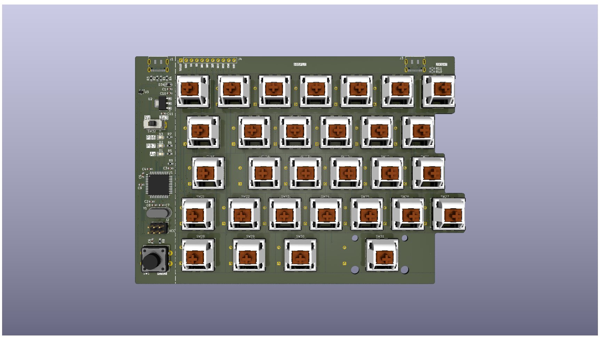
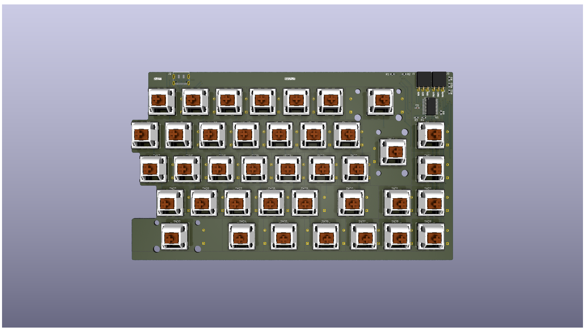

# PCB
Here is everything related to the PCB, with the design files for the two keyboard halves in `69split-left/` and `69split-right/`. The `3dmodels/` directory contains the 3D models I used to get the renders below. Read the `Circuit Description.md` file for a description on the design.

